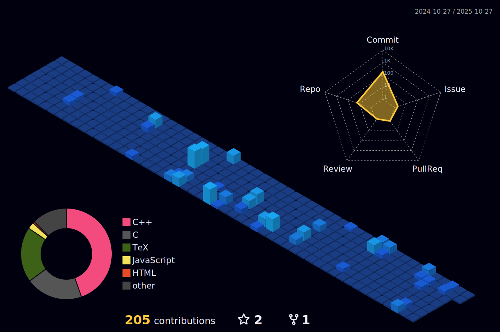

Trần Tôn Minh Kỳ (2006). Sophomore of Ho Chi Minh University of Science, majoring in Computer Science. Aspiring software engineer and lifelong learner, always creating something worth seeing!

"He who has never learned to obey cannot be a good commander." - Aristotle

